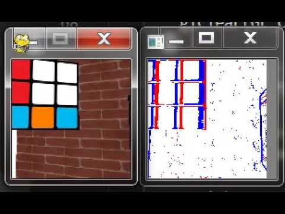

# AESIM: Active Event Camera Simulator
[](https://youtu.be/1CFUxxfl1Hs)

An active event camera simulator based on [DAVIS simulator](https://github.com/uzh-rpg/rpg_davis_simulator) and [ESIM](https://github.com/uzh-rpg/rpg_esim)

This is the code for 2020 AICAS paper: **Retinal Slip Estimation and Object Tracking with an Active Event Camera** by Qingpeng Zhu, Jochen Triesch, and Bertram Shi

```
@inproceedings{zhu2020retinal,
  title={Retinal Slip Estimation and Object Tracking with an Active Event Camera},
  author={Zhu, Qingpeng and Triesch, Jochen and Shi, Bertram E},
  booktitle={2020 2nd IEEE International Conference on Artificial Intelligence Circuits and Systems (AICAS)},
  pages={59--63},
  organization={IEEE}
}
```

We apply AESIM to test our proposed alogrithm on velocity estimation and object tracking tasks. This alogrithm is published in IEEE JETCAS.

```
@ARTICLE{9268109,
  author={Zhu, Qingpeng and Triesch, Jochen and Shi, Bertram E},
  journal={IEEE Journal on Emerging and Selected Topics in Circuits and Systems}, 
  title={An Event-by-Event Approach for Velocity Estimation and Object Tracking with an Active Event Camera}, 
  year={2020},
  volume={},
  number={},
  pages={1-1},
  doi={10.1109/JETCAS.2020.3040329}
 }
```


## New Features
* Active control of 6DOF camera
* Allow keyboard and mouse to control the camera
* Allow dynamic 3D environment

## Prerequisites

Install the following libraries:

```
pip intall numpy pygame PyOpenGL pyrr opencv-python
```

## Running the demo

```
python Demo_AESIM_KeyMouseControl
```

## Acknowledgments

The code of our OpenGL rendering engine is modified based on [Learn OpenGL](https://learnopengl.com/) tutorials.<br />
The display and control part is done by using [Pygame](https://www.pygame.org).<br />
The part that [AESIM](https://github.com/ZHUQINGPENG/Active-Event-Camera-Simulator) generates the simulated event data from the rendered images is modified from the [DAVIS simulator](https://github.com/uzh-rpg/rpg_davis_simulator).

## Contact us
Qingpeng ZHU: qzhuad@connect.ust.hk<br />
Bertram SHI: eebert@ust.hk
