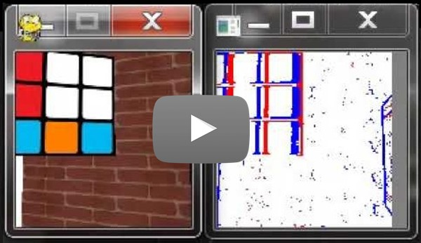

# Active Event Camera Simulator
[](https://youtu.be/1CFUxxfl1Hs)


An active event camera simulator based on [DAVIS simulator](https://github.com/uzh-rpg/rpg_davis_simulator) and [ESIM](https://github.com/uzh-rpg/rpg_esim)

## Features
* Active control of 6DOF camera
* Allow keyboard and mouse to control the camera
* Allow dynamic 3D environment

## Getting Started

These instructions will get you a copy of the project up and running on your local machine for development and testing purposes. See deployment for notes on how to deploy the project on a live system.

### Prerequisites

Install the following libraries:
if you use python 3

```
pip3 intall numpy pygame PyOpenGL pyrr opencv-python
```

### Installing

A step by step series of examples that tell you how to get a development env running

Say what the step will be

```
Give the example
```

And repeat

```
until finished
```

End with an example of getting some data out of the system or using it for a little demo

## Running the tests

Explain how to run the automated tests for this system


## Acknowledgments

[Lean OpenGL](https://learnopengl.com/) tutorial in our OpenGL rendering engine.
